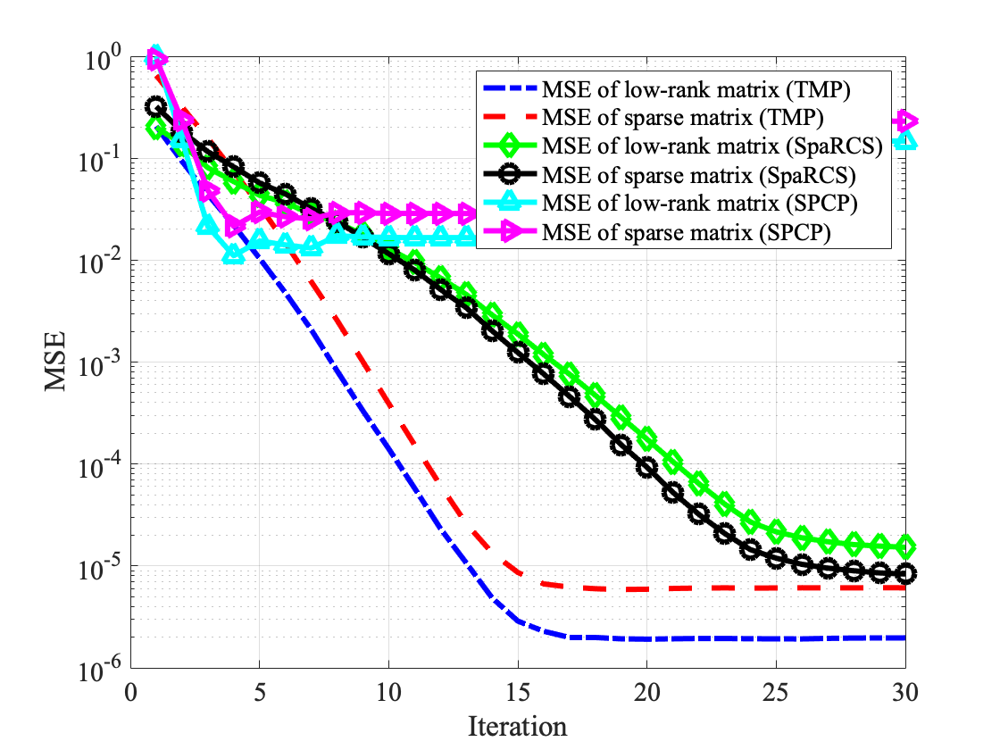
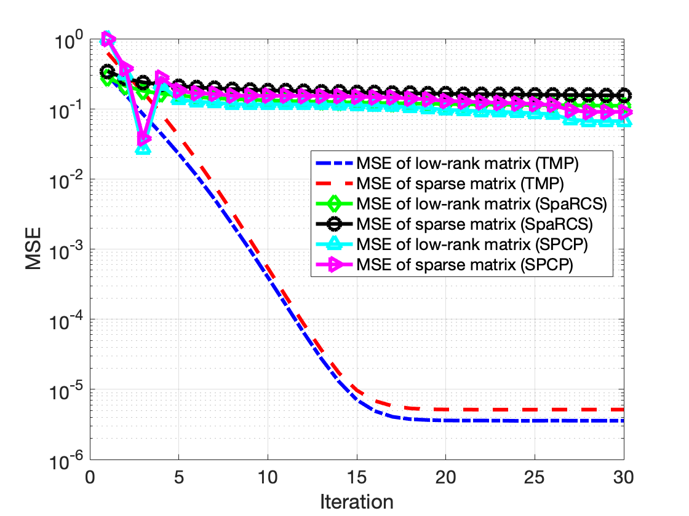

# Turbo-Type Message Passing Algorithms for Compressed Robust Principal Component Analysis

This repository contains the implementation of the **Turbo-Type Message Passing Algorithms for Compressed Robust Principal Component Analysis** algorithm proposed in the paper:

> Z. Xue, X. Yuan and Y. Yang, "Turbo-Type Message Passing Algorithms for Compressed Robust Principal Component Analysis," in *IEEE Journal of Selected Topics in Signal Processing*, vol. 12, no. 6, pp. 1182-1196, Dec. 2018, doi: 10.1109/JSTSP.2018.2876621.https://doi.org/10.1109/ACCESS.2017.2697978)

## Introduction

Turbo-type message passing (TMP) is a Bayesian message passing algorithm for the compressed RPCA problem. We show that the proposed TMP algorithm significantly outperforms the state-of-the-art compressed RPCA algorithms, and requires a much lower computational complexity.

## Code Structure

`TMP.m`: Turbo-Type Message Passing Algorithm with the low-rank denoiser set as the best rank-r denoiser

- Input parameters
  - `y`: measurement vector
  - `A`: sensing matrix, here we implement it as a linear opeartor
  - `At`: transpose of sensing matrix `A`
  - `params`: parameters used in recovery

`TMP_svt.m`: Turbo-Type Message Passing Algorithm with the low-rank denoiser set as the singular value soft thresholding (SVST) denoiser

`TMP_svht.m`: Turbo-Type Message Passing Algorithm with the low-rank denoiser set as the singular value hard thresholding (SVHT) denoiser

`soft_thresholding.m`: soft thresholding denoiser

`kernel_lin_1.m`: SURE-LET denoiser used in this paper

`div_svht.m`: divergence calculation of SVHT denoiser

`div_svt.m`: divergence calculation of SVST denoiser

`TMP_test.m`: comparisons of TMP algorithms with different low-rank matrix denoisers

`TMP_test2.m`: comparisons of different algorithms for compressed robust principal component recovery including SPCP and SpaRCS (users should install SPCP and SpaRCS matlab packages first)

## Citation

```
@ARTICLE{8502093,
  author={Z. {Xue} and X. {Yuan} and Y. {Yang}},
  journal={IEEE Journal of Selected Topics in Signal Processing}, 
  title={Turbo-Type Message Passing Algorithms for Compressed Robust Principal Component Analysis}, 
  year={2018},
  volume={12},
  number={6},
  pages={1182-1196},
  doi={10.1109/JSTSP.2018.2876621}}
```


## Test Result

Run `TMP_test2.m` and set the comparison parameters to the settings in fig6 (left) and fig6 (right) of the paper, you will get the following result:



